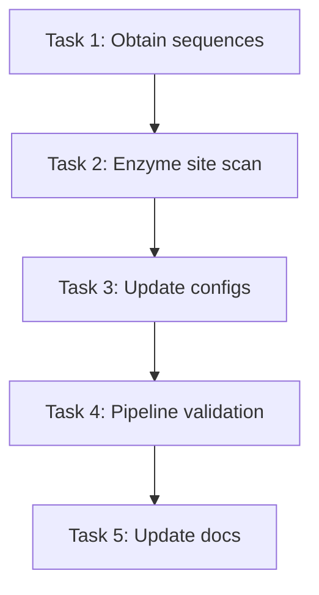

<!-- Created: 2026-03-02 -->
<!-- Last updated: 2026-03-02 — Initial plan -->

# Plan: Fix WPRE and Insulator in Downstream Cassette

## Background

The insulation design analysis (`docs/insulation_design_notes.md`, `Plans/260302_wpre-poliii-insulation-design.md`) concluded on this downstream cassette architecture:

```
[Gene 3' end] — [WPRE, ~592 bp] — [bGH polyA, ~225 bp] — [alpha-globin pause, ~90 bp] — [hU6+T7] — [barcode] — [PolIII terminator] — [PaqCI]
```

**Total: ~1,208 bp** — fits within a single 1,800 bp gene block (no cassette splitting needed for standard configs).

### What needs to change

The current configs (`grin2a.yaml`, `grin2a_long_cassette.yaml`) use:

| Element | Current | Target | Delta |
|---------|---------|--------|-------|
| WPRE | 589 bp (pTK4-GFP) | Same, verify | 0 |
| PolyA | hGH polyA, 477 bp | **bGH polyA, ~225 bp** | **-252 bp** |
| Pause element | None | **Alpha-2 globin pause, ~90 bp** | **+90 bp** |
| Spacer (31 bp) | Present | **Remove** (no longer needed) | **-31 bp** |
| **Net change** | | | **-193 bp** |

Net result: cassette shrinks by ~193 bp, making it more likely to fit within a single gene block.

---

## Tasks

### Task 1: Obtain and verify reference sequences

Source real, published sequences for the two new elements:

**a) bGH polyA signal (~225 bp)**
- Standard source: pcDNA3.1 (Invitrogen/Thermo Fisher), GenBank V00064 (bovine GH gene)
- Very widely used — sequence available from Addgene vectors, SnapGene, etc.
- Look for the minimal functional signal (AATAAA hexamer through downstream GU-rich region)

**b) Alpha-2 globin pause element (~90 bp)**
- Source: Human alpha-2 globin gene (HBA2), 3' flanking region
- Reference: Eggermont & Proudfoot 1993, EMBO J 12:2539-2548
- GenBank: NG_000006 (HBA2 locus) or J00153 (alpha-2 globin gene)
- Need the specific ~90 bp fragment shown to function as a pause element

**c) Verify existing WPRE sequence**
- Current: 589 bp from pTK4-GFP (Addgene)
- Cross-reference against a second source (e.g., Addgene #12252 pLenti-GIII-CMV-GFP or similar well-known WPRE-containing vector)

### Task 2: Scan new sequences for enzyme sites

For each new element (bGH polyA, alpha-globin pause):
- Check for BsmBI (`CGTCTC` / `GAGACG`) on both strands
- Check for PaqCI (`CACCTGC` / `GCAGGTG`) on both strands
- Also check junction sequences (where elements meet) for spanning sites
- If sites found: document position and assess whether silent mutation is possible

### Task 3: Update config files

**a) Create a reference sequence data file** (`data/cassette_elements/` or similar):
- Store verified bGH polyA and alpha-globin pause sequences as FASTA or in a structured format
- Include source annotations (GenBank accession, vector name, coordinates)
- These become the canonical sequences the lab uses

**b) Update `configs/grin2a.yaml`**:
- Replace `hGH_polyA` with `bGH_polyA` in `intergene_elements`
- Remove the `spacer` element (was between WPRE and hGH polyA — no longer needed)
- Add `alpha_globin_pause` element between bGH polyA and PolIII
- Final order: WPRE → bGH polyA → alpha-globin pause → (PolIII promoter, configured separately)

**c) Update `configs/grin2a_long_cassette.yaml`**:
- Same element swap as above
- Keep the P2A-EGFP (it's a test case for cassette splitting)
- Update the header comments with new cassette size math

**d) Consider updating `configs/akap11.yaml` and `configs/trio.yaml`** if they have intergene elements

### Task 4: Run pipeline validation

- Run the pipeline on the updated `grin2a.yaml` config
- Verify:
  - Enzyme site scan reports no BsmBI/PaqCI in new elements (or reports + domesticates them)
  - Downstream cassette total size matches expectations (~1,208 bp)
  - No cassette splitting triggered (cassette < 1,778 bp threshold)
  - All gene blocks within synthesis limit
  - All tests still pass (`devtools::test()`)
- Run `grin2a_long_cassette.yaml` to verify cassette splitting still works with the modified elements

### Task 5: Update documentation

- Update `docs/insulation_design_notes.md` — mark "Next Steps" as done
- Add sequence sources/accessions to the design notes
- Check `Plans/260302_wpre-poliii-insulation-design.md` — mark completed items

---

## Dependency Graph



All tasks are sequential — each depends on the previous.

---

## Risks / Open Questions

1. **bGH polyA exact boundaries** — multiple slightly different versions exist in the literature (220–230 bp). Need to pick a well-validated one and stick with it. pcDNA3.1 is the safest reference.

2. **Alpha-globin pause element boundaries** — the Eggermont & Proudfoot 1993 paper defined the functional region, but different groups use slightly different fragments. Need to identify the exact coordinates from HBA2 that were tested.

3. **Enzyme sites in new elements** — if bGH polyA or the pause element contain BsmBI/PaqCI sites, we can't silently mutate them (they're regulatory, not coding). We'd need to either accept the site and work around it, or find an alternative element. This is unlikely for such short, well-used sequences but needs checking.

4. **Should the spacer be removed or kept?** — The 31 bp spacer between WPRE and polyA in the current config was arbitrary. With the switch to bGH polyA, it's probably not needed. But if there's a functional reason (e.g., preventing sequence-context effects between WPRE and polyA), we should keep it. **Recommend removing it** — WPRE → polyA is the standard arrangement in published vectors.
