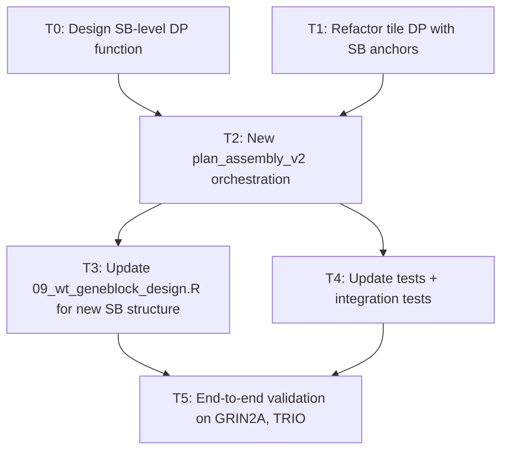

<!-- Created: 2026-03-04 -->
<!-- Last updated: 2026-03-04 — Initial plan -->

# SB-First DP Refactor: Two-Pass Assembly Planning

## Motivation

The current assembly planning (`plan_assembly()` in `06_overhang_selection.R`) uses a
single-pass approach: DP on the full gene to find tile boundaries, then greedy grouping
of tiles into superblocks, with an iterative OPT-005 collision-resolution loop that can
re-run the full DP up to 5 times.

This plan reverses the order: **superblock boundaries first, then tiles within each
superblock.** This is architecturally cleaner, computationally cheaper, and eliminates
the OPT-005 iteration hack.

## Key Insight

Superblock (SB) boundary overhangs are "global" — they appear in multiple tiles'
reactions (any tile whose 5'WT or 3'WT spans an SB boundary sees that overhang). Tile
boundary overhangs are "local" — they only appear in that tile's own reaction(s).
Deciding globals first and locals second is the natural order.

## Architecture Overview

### Current (single-pass)
```
Full-gene DP → tile boundaries → greedy SB grouping → OPT-005 collision iteration
```

### Proposed (two-pass)
```
Pass 1: SB DP on gene+cassette → SB boundaries (few splits, trivially fast)
Pass 2: Per-SB tile DP → tile boundaries (small, independent, parallelizable)
         Blacklist: SB boundary OHs + static OHs (oh_L, oh3, oh4)
```

### Physical Assembly (unchanged)
The physical assembly scheme does not change. For each tile T in superblock SB_j:
- **BsaI reaction:** oh_L + {SB junction OHs upstream of T} + oh1_T + oh4
- **BsmBI reaction:** oh2_T + {SB junction OHs downstream of T} + oh3
- **PaqCI Level 2:** Full insert into backbone (unchanged)

## Detailed Design

### Pass 1: SB-Level DP (`search_superblock_boundaries_dp`)

**Input:** Full sequence = gene CDS + cassette (intergene elements + PolIII)
**Output:** SB boundary positions + their gene-derived 4-nt overhangs

**DP formulation:**
- State: `dp[k, p]` = best total score placing k SB boundaries with k-th at position p
- Score: `overhang_score(gene_4nt_at_p)` = P_fid(oh) * P_eff(oh) from BsmBI cycling matrix
- Constraints:
  - Each SB segment <= `max_block_length` (default 1800 bp)
  - Each SB segment >= `min_block_length` (suggest ~500 bp; no point in tiny SBs)
  - Position p can be at any nucleotide (not constrained to codon boundaries — SB
    junctions are ligated seamlessly). But constraining to codon boundaries is fine
    and keeps things consistent.
- K range: `K_min = ceil(total_length / max_block_length) - 1` to `K_max = K_min + 2`
  (very narrow; usually only 1-3 values to try)
- Blacklist: oh_L, oh3, oh4, palindromes, homopolymers (these are known before SB DP)

**For GRIN2A (4302 bp gene + ~300 bp cassette = ~4600 bp):**
- K = ceil(4600/1800) - 1 = 2 internal boundaries → 3 SBs
- DP over ~1530 codon positions, K = 2-3 → trivially fast

**Cassette handling:**
- Cassette is appended to gene CDS as a single contiguous sequence for the SB DP
- The SB DP treats it uniformly — if the cassette is long (>1800 bp), the DP naturally
  places an SB boundary within the cassette region
- The cassette portion has no codon-boundary constraint (no mutations there)
- This elegantly handles BUG-004 (large downstream cassette) — no special-case splitting

### Pass 2: Per-SB Tile DP (`search_tile_boundaries_within_sb`)

**Input:** SB segment of the gene (coding region only), anchor overhangs at SB boundaries
**Output:** Tile boundary positions within this SB

**DP formulation:**
- Same structure as the current `search_tile_boundaries_dp`, but operating on a
  smaller sequence (one SB's worth of gene, ~400-600 codons)
- Tile size constraints: [min_codons, max_codons] (same as current, ~54-81 codons)
- **Fixed endpoints ("anchors"):**
  - First tile's oh1 = SB boundary with previous SB (or oh_L for the first SB)
  - Last tile's oh2 = SB boundary with next SB (or gene-end for the last SB)
  - These are NOT optimized — they're inputs from Pass 1
- **Blacklist:** SB boundary overhangs (all of them, globally) + oh_L + oh3 + oh4

**Key benefit — overhang reuse across SBs:**
- Tile overhangs within SB1 and SB3 can be identical (different reactions)
- Only overhangs within the SAME SB need to be mutually unique
- This relaxes uniqueness pressure for long genes

**For GRIN2A (3 SBs of ~480 codons each):**
- Each tile DP: ~480 positions, K ≈ 5-6 → fast
- 3 independent DPs (could run in parallel, though R's overhead makes this marginal)

### oh3/oh4 Selection (before both DPs)

**Timing change:** oh3 and oh4 must be determined BEFORE both DPs, since both DPs
blacklist them.

- **oh3:** Derived from PolIII promoter terminal 5 nt (same as current)
- **oh4:** Score-selected from high-fidelity candidates, excluding oh_L
- Both are known before any DP runs → clean dependency

### New `plan_assembly_v2()` Orchestration

```
1. Compute oh3 (from promoter) and oh4 (score-selected)
2. Build full sequence: gene CDS + cassette
3. Run SB DP → SB boundaries + overhangs
4. For each SB (gene-coding portion only):
     Run tile DP with SB boundary anchors + blacklist
5. Merge tile results across SBs into unified tile table
6. Assign variants to tiles (unchanged)
7. Per-reaction set-fidelity validation (unchanged)
```

**OPT-005 is eliminated.** No collision iteration needed because SB overhangs are
fixed before tile DP, and tile DP blacklists them upfront.

## Tile Overlap at SB Boundaries

Adjacent tiles across an SB boundary still need the standard 4-codon overlap:
- Last tile of SB_j: its oh2 = SB boundary overhang (gene-derived 4 nt)
- First tile of SB_{j+1}: its oh1 = same SB boundary overhang
- Overlap codons span the boundary — works naturally
- The mutable regions of both tiles share ~4 codons near the boundary, ensuring
  all codons are mutable by at least one tile

## Edge Cases

1. **Short gene (no SBs needed):** gene + cassette <= max_block_length → K=0, skip SB DP,
   run tile DP on entire gene. Identical to current behavior for small genes.
2. **Very long cassette (>1800 bp):** SB DP places boundary within cassette. Cassette
   portion doesn't get tiled (no mutations). Sub-blocks are BsmBI-connected fragments.
3. **Gene barely exceeds 1 SB:** e.g., 2000 bp gene → 1 SB boundary. SB DP finds the
   single best split point. Tile DPs run on two ~1000-codon chunks.

## Dependency Graph



**Parallelizable:** T0 and T1 are independent (can run in parallel worktrees).
T3 and T4 are independent after T2.

## Task Breakdown

### T0: SB-Level DP Function (new)
- **File:** `R/06_overhang_selection.R`
- New function `search_superblock_boundaries_dp(full_seq, max_block_length, min_block_length, blacklist_ohs, oh_fidelity, eff_lookup)`
- Returns: data frame with `sb_id, start_nt, end_nt, boundary_oh, boundary_score`
- Simpler than tile DP: no codon constraint (or optional), wider segments, fewer K values
- Unit tests in `tests/testthat/test-sb-dp.R`

### T1: Refactor Tile DP with SB Anchors
- **File:** `R/06_overhang_selection.R`
- Modify `search_tile_boundaries_dp()` to accept:
  - `anchor_oh1` (fixed oh1 for first tile, from SB boundary)
  - `anchor_oh2` (fixed oh2 for last tile, from SB boundary)
  - `sb_blacklist` (SB boundary overhangs to avoid)
- The DP operates on a subsequence of the gene (one SB's coding region)
- Existing scoring and constraint logic reused; just narrower scope + anchors
- Unit tests for anchor behavior

### T2: New `plan_assembly_v2()` Orchestration
- **File:** `R/06_overhang_selection.R`
- Implements the 7-step orchestration above
- Replaces current `plan_assembly()` (keep old as `plan_assembly_v1()` temporarily for comparison)
- Cassette concatenation: `full_seq = paste0(gene_cds, cassette_seq)`
- Merge per-SB tile tables into unified output format (same schema as current)
- Remove OPT-005 collision iteration logic

### T3: Update WT Gene Block Design
- **File:** `R/09_wt_geneblock_design.R`
- Adapt `design_wt_geneblocks()` to consume the new SB+tile structure
- SB boundaries are now inputs (from plan), not computed internally
- Cassette sub-blocks: if cassette spans multiple SBs, each sub-block is a BsmBI fragment
- `partition_tile_superblocks()` may be simplified or replaced

### T4: Update Tests
- **Files:** `tests/testthat/test-overhang-selection.R`, `test-wt-geneblock-design.R`, new `test-sb-dp.R`
- New unit tests for SB DP (short gene, GRIN2A-length, cassette-spanning)
- Update existing tile DP tests to use anchor API
- Integration test: full pipeline on TEST_GENE_SEQ (300 nt) and TEST_LONG_GENE_SEQ (2100 nt)
- Worktree-based testing to avoid polluting the branch

### T5: End-to-End Validation
- Run full pipeline on GRIN2A and TRIO configs
- Compare output quality (tile boundaries, SB boundaries, set fidelity) vs. main branch
- Performance comparison (expect faster due to smaller DPs + no OPT-005 iteration)
- Flag any regressions

## Files Modified

| File | Change |
|------|--------|
| `R/06_overhang_selection.R` | New SB DP function, refactored tile DP, new `plan_assembly_v2()` |
| `R/09_wt_geneblock_design.R` | Adapt to new SB+tile structure |
| `R/run_pipeline.R` | Call `plan_assembly_v2()` instead of `plan_assembly()` |
| `tests/testthat/test-sb-dp.R` | New: SB DP unit tests |
| `tests/testthat/test-overhang-selection.R` | Update tile DP tests for anchor API |
| `tests/testthat/test-wt-geneblock-design.R` | Update for new SB structure |

## Branch Strategy

- **Working branch:** `260304-sb-first-dp` (this branch)
- **Worktrees for parallel tasks:** T0 and T1 in separate worktrees off this branch
- **Testing worktrees:** T4 and T5 in worktrees for isolation
- Merge worktree branches back into `260304-sb-first-dp`
- Final PR from `260304-sb-first-dp` → `main`

## Success Criteria

1. All existing tests pass (FAIL 0, adjusted for new API)
2. GRIN2A and TRIO produce valid outputs with set fidelity >= current
3. No OPT-005 collision iteration (logged as eliminated)
4. Pipeline runtime equal or faster than current
5. Cassette handling works for normal and oversized cassettes
